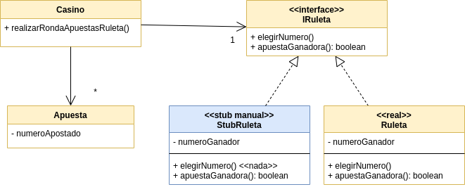

# Ejemplo de Testing con Stubs y Mocks - Ruleta Virtual

[](https://github.com/uqbar-project/eg-ruletas-kotlin/actions/workflows/gradle-build.yml) [](https://codecov.io/gh/uqbar-project/eg-ruletas-kotlin?branch=stubbing-roulette)

## Branch stubbing-roulette

Arreglamos los _flaky tests_ implementando un _stub_ manual que permite configurar el número ganador de la ruleta virtual:

```kt
class StubRuleta(val numeroGanador: Int) : IRuleta {
    override fun elegirNumero() {}

    override fun apuestaGanadora(apuesta: Apuesta) = apuesta.numeroApostado == numeroGanador
}
```

En el test reemplazamos la ruleta que elige números al azar por una ruleta fija, que nos permite controlar el número ganador:

```kt
describe("Cuando sale un número") {
    val apuestaGanadora = Apuesta(5, "winner@roulette.com")
    val apuestaPerdedora = Apuesta(2, "looser@roulette.com")
    val casino = Casino().apply {
        // controlamos el número ganador de la ruleta
        ruleta = StubRuleta(5)
        //
        apostar(apuestaGanadora)
        apostar(apuestaPerdedora)
    }
```

De esa manera sabemos fehacientemente que quien apostó al 5 debería ganar, y el que apuesta al 2 pierde:

```kt
val apuestasGanadoras = casino.realizarRondaApuestasRuleta()
it("La apuesta ganadora se devuelve") {
    apuestaGanadora shouldBeIn apuestasGanadoras
}
it ("La apuesta perdedora se filtra") {
    apuestaPerdedora shouldNotBeIn apuestasGanadoras
}
```

El objeto impostor es un _stub_ sobre la ruleta, porque nuestros tests estudian el estado en el que queda la aplicación (preguntando por las apuestas ganadoras). Este approach se parece bastante a lo que venimos trabajando hasta el momento.

## Diagrama de clases de la solución

