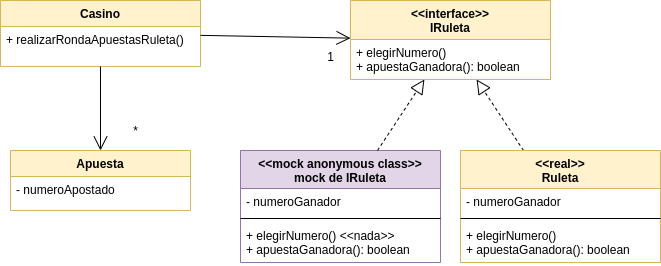

# Ejemplo de Testing con Stubs y Mocks - Ruleta Virtual

[](https://github.com/uqbar-project/eg-ruletas-kotlin/actions/workflows/gradle-build.yml) [](https://codecov.io/gh/uqbar-project/eg-ruletas-kotlin?branch=stubbing-roulette-mockk)

## Branch stubbing-roulette-mockk

En esta variante en lugar de construir nosotros un stub vamos a delegar en el framework [Mockk](https://mockk.io/) la creación del objeto impostor.

Para ello en el test invocamos a una función que crea un **objeto anónimo que respeta la interfaz IRuleta**:

```kt
fun stubRuleta(numeroGanador: Int): IRuleta {
    val ruleta = mockk<IRuleta>(relaxUnitFun = true)

    every { ruleta.apuestaGanadora(apuesta = any()) } answers { firstArg<Apuesta>().numeroApostado == numeroGanador }

    return ruleta
}
```

- La función `mockk` trabaja con Generics, se tipa como IRuleta, de esa manera sabemos qué métodos tenemos que definir
- El parámetro `relaxUnitFun` permite crear un **relaxed stub**, esto significa que por defecto todos los métodos que no devuelvan nada (Unit) se definen con un comportamiento vacío (no necesitamos explícitamente decirle a Mockk que el método `elegirNumero()` no hace nada, como pasaba en el stub manual)
- Luego la función `every ... answer` permite definir que cuando el objeto ruleta que estamos creando recibe el mensaje apuestaGanadora, con cualquier apuesta (`any()`), responderemos que sí o que no basado en que el número apostado sea el número que nosotros definimos como ganador (es el parámetro de la función `stubRuleta`)

El objeto impostor sigue siendo un _stub_ sobre la ruleta, porque nuestros tests estudian el estado en el que queda la aplicación (preguntando por las apuestas ganadoras). Este approach se parece bastante a lo que venimos trabajando hasta el momento.

## Diagrama de clases de la solución

