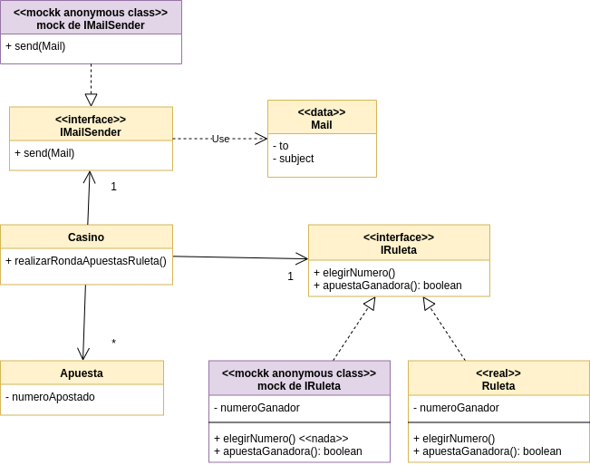

# Ejemplo de Testing con Stubs y Mocks - Ruleta Virtual

[](https://github.com/uqbar-project/eg-ruletas-kotlin/actions/workflows/build.yml) [](https://codecov.io/gh/uqbar-project/eg-ruletas-kotlin?branch=mock-tests)

## Branch mock-tests

Ahora el método en Casino que orquesta la llamada a la ruleta y detecta las apuestas ganadoras no devuelve esa información, sino que envía un mail a los ganadores.

```kt
fun realizarRondaApuestasRuleta() {
    ruleta.elegirNumero()

    return apuestas
        .filter { apuesta -> ruleta.apuestaGanadora(apuesta) }
        .forEach { apuesta -> mailSender.sendMail(Mail(apuesta.casillaCorreo, "Ganaste!"))}
}
```

## Cambiando la forma de testear

Si el método no devuelve nada, porque solo produce el efecto de envío de mails, ¿cómo podemos hacer para testear? Aquí es donde activamos los tests basados en **comportamiento** en lugar del **estado**, y para eso

- continuamos trabajando con una ruleta ad-hoc, que permite fijar un número ganador, pero además
- vamos a mockear el objeto que envía el mail (definido por la interfaz IMailSender)

No nos interesa fingir ningún comportamiento en particular, solo queremos envolverlo con el framework Mockk:

```kt
fun mockedMailSender(): IMailSender = mockk<IMailSender>(relaxUnitFun = true)
```

Luego asignamos ese objeto al casino antes de hacer la llamada al método principal:

```kt
    describe("Dada una ruleta en un casino") {
        describe("Cuando sale un número") {
            ...
            val mockedMailSender = mockedMailSender()
            val casino = Casino().apply {
                // controlamos el número ganador de la ruleta y el objeto que envía mails\\
                ruleta = mockRuleta(5)
                mailSender = mockedMailSender
                //
```

## Verificación en los tests

Una vez que le pedimos al casino que realice la ronda de apuestas, vamos a verificar

- que el casino le envíe el mail a la apuesta ganadora, mediante la pregunta `verify` que valida que se envíe un mensaje `sendMail` al mailSender mockeado con los parámetros que esperamos
- de la misma manera, no se debe enviar ningún mail al perdedor

```kt
    val apuestasGanadoras = casino.realizarRondaApuestasRuleta()
    it("El ganador recibe un mail") {
        verify(exactly = 1) { mockedMailSender.sendMail(mail = Mail(apuestaGanadora.casillaCorreo, "Ganaste!")) }
    }
    it ("El perdedor no recibe mail") {
        verify(exactly = 0) { mockedMailSender.sendMail(mail = Mail(apuestaPerdedora.casillaCorreo, "Ganaste!")) }
    }
```

No estamos preguntando por el estado de nuestro sistema (como podría ser si en la casilla de mail del ganador hay un mail), sino por el envío de mensajes a objetos anónimos cuyo comportamiento solo nos interesa para hacer verificaciones en nuestros tests.

## Diagrama de clases de la solución

